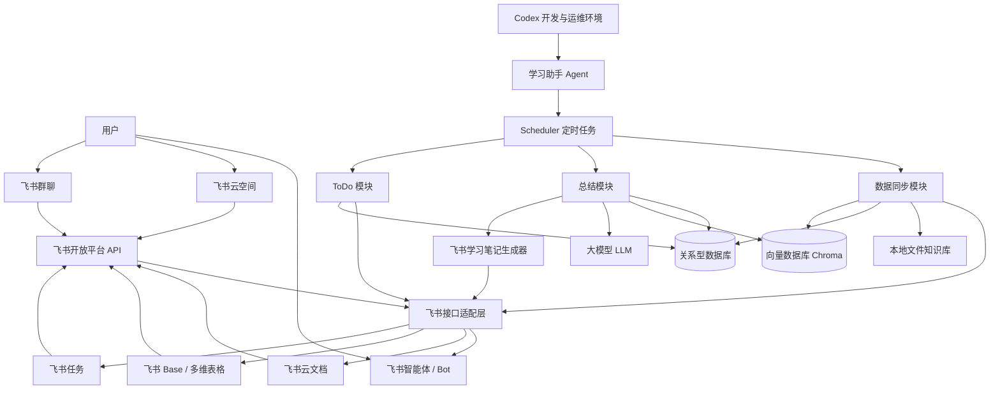
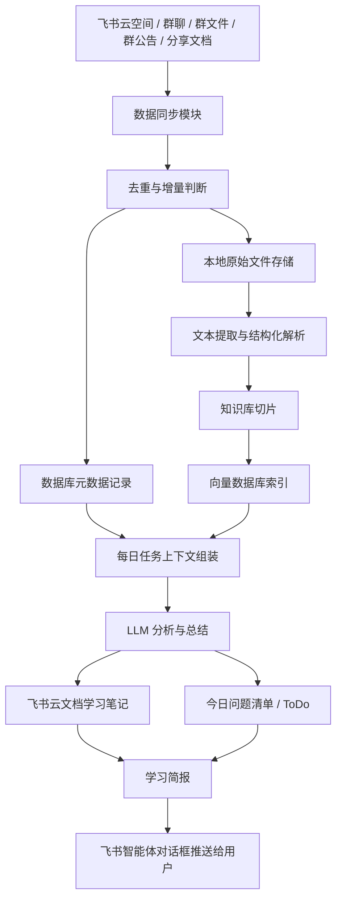
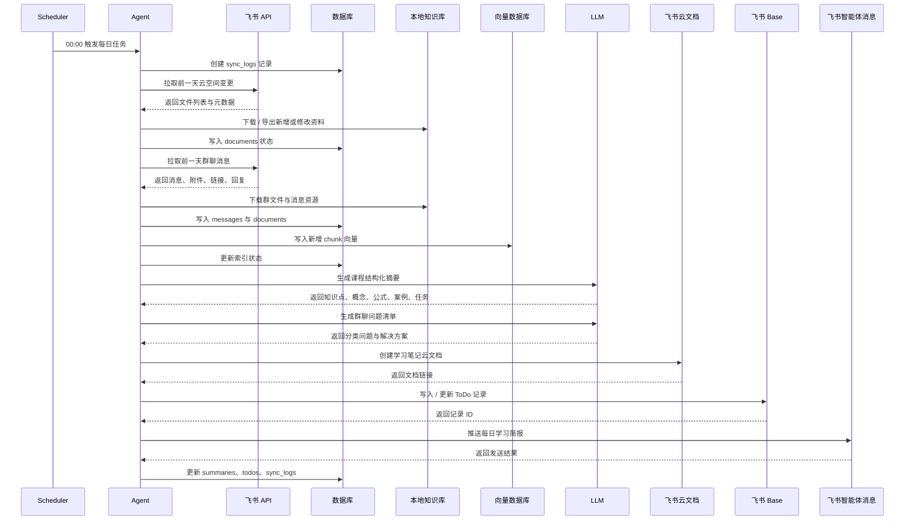

# Feishu_AI_Learning_Assistant_Architecture.md

## 1. 项目概述

《飞书智能学习助手》是一个运行在本地或服务器上的自动化 AI Agent 系统，用于每日同步飞书课程资料、群聊内容、群文件、群内分享文档，并生成学习简报、飞书学习笔记和问题 ToDo 管理记录。

系统目标：

- 每日自动同步飞书云空间课程资料与群聊资料。
- 对前一天课程资料进行总结，生成学习简报。
- 为每个知识点保留可点击的原始资料引用。
- 自动创建飞书云文档形式的学习笔记。
- 对群聊问题进行归纳，识别高频、重复、未解决、已解决问题。
- 使用飞书生态完成 ToDo 管理、状态追踪和历史沉淀。
- 支持本地部署、Docker 部署和云服务器部署。

推荐技术路线：

- Python 作为主开发语言。
- FastAPI 提供本地管理 API。
- APScheduler 或 Celery Beat 负责定时任务。
- SQLite 作为本地 MVP 数据库，PostgreSQL 作为生产推荐数据库。
- Chroma 作为默认向量数据库。
- 飞书 OpenAPI / lark-cli / Lark SDK 负责飞书数据读写。
- LLM 负责课程总结、问题归纳、知识点抽取和笔记生成。
- Base / 多维表格作为 ToDo 主账本，必要时同步创建飞书任务。

---

## 2. 总体架构



核心模块说明：

| 模块 | 职责 |
|---|---|
| Agent | 系统主协调器，负责任务编排、异常处理、状态流转 |
| Scheduler | 每天 00:00 触发同步、总结、推送、ToDo 生成 |
| Lark Adapter | 封装飞书 OpenAPI、lark-cli、SDK 调用 |
| Sync Module | 同步云空间、群文件、群公告、群消息、分享文档 |
| Storage Module | 管理本地原始文件、导出文件、解析文本、元数据 |
| RAG Module | 文档切片、向量化、召回、知识点引用绑定 |
| Summary Module | 学习简报、问题清单、学习笔记内容生成 |
| Todo Module | 生成 Base 记录，可选同步飞书任务 |
| DB | 保存同步状态、消息、文档、总结、ToDo、日志 |
| Vector DB | 保存课程资料和聊天内容切片向量 |

---

## 3. 数据流程



数据流说明：

1. 系统每日读取飞书云空间文件夹、指定群聊、群文件、群公告和群内分享文档。
2. 根据文件 token、版本号、修改时间、消息 ID、内容哈希判断是否新增或变更。
3. 原始文件下载到本地知识库，元数据写入数据库。
4. 文档内容解析为文本，按章节、页码、标题或消息上下文切片。
5. 切片内容写入向量数据库，并保留原始文件、飞书文档链接、云盘链接。
6. LLM 生成学习简报、学习笔记、问题清单。
7. 系统创建飞书云文档学习笔记。
8. 系统通过飞书智能体对话框推送每日简报给用户。
9. 问题清单写入 Base / 多维表格，支持状态追踪和历史查询。

---

## 4. 功能一：课程资料自动整理

### 4.1 输入配置

用户需要提供：

| 配置项 | 示例 | 用途 |
|---|---|---|
| 飞书云空间文件夹 ID / folder_token | `fldxxxx` | 课程资料根目录 |
| 飞书群聊会话 ID / chat_id | `oc_xxxx` | 读取群消息、群文件、分享文档 |
| 简报接收人 | 用户 open_id 或 chat_id | 每日简报推送目标 |
| 学习笔记保存位置 | folder_token 或 wiki node token | 生成云文档保存目录 |
| ToDo Base 地址 | app_token / table_id | 问题清单和任务追踪 |

### 4.2 数据采集范围

每日采集内容：

1. 飞书云文件夹中的全部资料。
2. 新增资料。
3. 修改资料。
4. 群文件。
5. 群公告。
6. 群内分享文档。
7. 群内消息中的图片、附件、文档链接。
8. 群内被回复、被引用的关键消息。

### 4.3 如何获取文件

云空间文件夹：

- 使用 Drive 文件夹列表接口或 `lark-cli drive +pull` 获取文件。
- 对普通附件类文件，直接下载到本地。
- 对飞书在线文档、电子表格、幻灯片、Base，需要先导出为可解析格式。
- 对 Wiki 节点，先解析 wiki token，再获取真实 obj_token。

群文件：

- 使用 IM 消息列表读取指定时间范围内的群消息。
- 解析消息中的 file、image、media、post-embedded resource。
- 对消息资源使用消息资源下载接口或 `lark-cli im +chat-messages-list --download-resources` 下载。
- 下载后将消息 ID、file_key、文件名、发送人、发送时间绑定入库。

群内分享文档：

- 解析消息正文中的飞书链接。
- 使用 Drive inspect/search 或 Docs/Wiki API 解析 token、类型、标题。
- 对可访问文档执行导出或正文读取。
- 将“消息来源”和“文档来源”同时记录，便于追溯。

群公告：

- 优先通过飞书 IM 群公告相关 OpenAPI 获取。
- 如果当前租户或 API 权限无法直接读取群公告，则采用兼容策略：
  - 将群公告配置为固定飞书文档，系统读取该文档。
  - 或从群消息中的公告更新系统消息中提取公告变更记录。
- 实施阶段需要用当前应用权限实际验证公告读取能力。

### 4.4 增量同步策略

对云空间文件：

| 判断维度 | 用途 |
|---|---|
| file_token / obj_token | 判断是否同一远程资源 |
| parent_folder_token | 判断文件所在目录 |
| name | 展示与路径生成 |
| type | 判断下载、导出、解析方式 |
| size | 辅助判断是否变化 |
| modified_time | 快速判断是否需要重新同步 |
| version_id / revision | 在线文档版本判断 |
| content_hash | 最终去重依据 |

同步规则：

- 第一次运行：全量扫描文件夹，下载可下载文件，导出在线文档。
- 后续运行：仅同步 `modified_time` 晚于上次成功同步时间的文件。
- 对同名不同 token 文件，不覆盖，使用 token 作为唯一身份。
- 对 token 相同但 modified_time 变化的文件，创建新版本记录。
- 对下载失败文件，记录失败状态，下次继续重试。
- 对已删除远程文件，默认本地保留，只标记 `remote_deleted = true`，不自动删除本地文件。

对群消息：

| 判断维度 | 用途 |
|---|---|
| message_id | 消息唯一去重 |
| chat_id | 群聊维度 |
| create_time | 时间范围查询 |
| update_time | 判断消息是否编辑 |
| message_type | 解析策略 |
| content_hash | 内容变化判断 |

同步规则：

- 每天读取前一天 `00:00:00` 到 `23:59:59` 的消息。
- 以 `message_id` 去重。
- 如果消息被编辑，更新 `updated_at_remote` 和正文内容。
- 附件以 `message_id + file_key` 去重。
- 同一文档链接在多个消息中出现，只下载一次，但保留多条引用关系。

### 4.5 避免重复下载

系统使用四级去重：

1. 远程资源 ID 去重：`file_token`、`obj_token`、`message_id`、`file_key`。
2. 版本去重：`modified_time`、`version_id`、`revision`。
3. 内容去重：本地计算 `sha256`。
4. 语义索引去重：向量切片使用 `source_id + chunk_index + chunk_hash`。

本地文件命名建议：

```text
knowledge_base/raw/drive/{file_token}/{version}/{original_name}
knowledge_base/raw/chat/{chat_id}/{yyyy-mm-dd}/{message_id}_{file_key}_{original_name}
knowledge_base/exported/{source_type}/{source_id}/{version}.md
knowledge_base/parsed/{source_type}/{source_id}/{version}.json
```

### 4.6 同步状态记录

每次同步生成一条 `sync_logs` 记录。

状态包括：

| 状态 | 含义 |
|---|---|
| pending | 等待执行 |
| running | 正在执行 |
| success | 成功完成 |
| partial_success | 部分成功 |
| failed | 失败 |
| skipped | 无变化跳过 |

同步状态需要记录：

- 本次同步开始和结束时间。
- 本次扫描远程资源数量。
- 新增数量。
- 修改数量。
- 跳过数量。
- 失败数量。
- 失败原因。
- 下一次重试建议。

---

## 5. 课程内容总结设计

### 5.1 执行时间

每天 `00:00 Asia/Shanghai` 执行。

处理范围：

- 前一天 `00:00:00` 到 `23:59:59` 的课程资料。
- 前一天新增或修改的云空间资料。
- 前一天群聊中分享的课程资料。
- 前一天群文件与附件。
- 前一天群公告变化。

### 5.2 学习简报内容

每日学习简报包含：

| 模块 | 内容 |
|---|---|
| 当天课程主题 | 从文档标题、群消息、公告、老师发言中综合判断 |
| 课程知识点 | 按主题聚合知识点 |
| 核心概念 | 提取关键术语、定义、边界 |
| 重要公式 | 识别公式、参数含义、适用条件 |
| 重要案例 | 提取案例背景、操作过程、结论 |
| 老师布置任务 | 从老师消息、公告、文档作业区提取 |
| 作业要求 | 提交物、格式、截止时间、评分标准 |
| 实践要求 | 需要动手操作的软件、环境、步骤 |
| 今日问题清单链接 | 关联 Base 视图或云文档 |
| 学习笔记链接 | 自动生成的飞书云文档链接 |

### 5.3 智能体对话框推送

推送方式：

- 使用飞书 IM 发送消息接口。
- 接收目标可以是用户 open_id 或指定 chat_id。
- 推荐使用 Markdown / Post 富文本消息。
- 每日简报消息需要携带幂等键，避免重复推送。
- 推送失败时记录到 `summaries.push_status`，进入重试队列。

### 5.4 源文件引用

每个知识点必须携带来源引用：

| 引用字段 | 内容 |
|---|---|
| 原始文件名称 | 文件或文档标题 |
| 飞书文档链接 | docx / wiki / sheet / slides 原链接 |
| 飞书云盘链接 | drive 文件链接或文件夹链接 |
| 消息链接 | 如可获取，则记录群消息定位链接 |
| 页码 / 章节 / chunk | 本地解析定位信息 |
| 引用置信度 | LLM 判断来源匹配程度 |

输出展示格式建议：

```text
知识点：RAG 的召回增强生成流程
来源：
- 《第3课：知识库搭建》 飞书文档链接
- 云盘文件：《RAG课程讲义.pdf》
- 群消息：老师在 2026-06-17 20:13 分享
```

### 5.5 学习笔记云文档

自动生成飞书云文档。

文档标题格式：

```text
YYYY-MM-DD 学习笔记 - 课程主题
```

内容结构：

```text
# YYYY-MM-DD 学习笔记

## 一、课程总结

## 二、知识图谱

## 三、重点内容

## 四、核心概念

## 五、重要公式

## 六、重要案例

## 七、易错点

## 八、作业说明

## 九、实践要求

## 十、来源资料
```

知识图谱建议：

- MVP 阶段使用 Mermaid 文本图写入文档。
- 后续可升级为飞书画板或图片。
- 节点包括概念、工具、任务、案例、作业。

---

## 6. 功能二：群聊问题归纳系统

### 6.1 数据读取范围

用户提供群聊 `chat_id`。

系统每日读取前一天：

```text
00:00:00 - 23:59:59
```

内容包括：

- 文本消息。
- 富文本消息。
- 回复与 thread。
- 图片。
- 文件。
- 语音、视频、媒体附件。
- 群内分享文档链接。
- 表情反应。
- 被引用消息。
- 老师或助教的回复。

### 6.2 问题识别

系统识别以下类型：

| 类型 | 识别逻辑 |
|---|---|
| 高频问题 | 相似问题聚类后出现次数高 |
| 重复问题 | 语义相似度高、答案相近 |
| 未解决问题 | 有提问但无老师/助教/同学有效回答 |
| 已解决问题 | 有明确回答、确认、感谢、采纳 |
| 学习难点 | 多人围绕同一知识点持续讨论 |
| 常见错误 | 包含报错、失败、配置错误、作业误区 |

### 6.3 问题分类

输出《今日问题清单》：

```text
# 今日问题清单

## 知识理解问题
- 问题
- 解决方案
- 来源消息
- 状态

## 环境配置问题
- 问题
- 解决方案
- 来源消息
- 状态

## 作业问题
- 问题
- 解决方案
- 来源消息
- 状态

## 其他问题
- 问题
- 解决方案
- 来源消息
- 状态
```

状态建议：

| 状态 | 含义 |
|---|---|
| new | 新发现 |
| resolved | 已解决 |
| unresolved | 未解决 |
| duplicated | 重复问题 |
| needs_teacher | 需要老师确认 |
| converted_to_task | 已转 ToDo |
| closed | 已关闭 |

### 6.4 问题解决方案生成

解决方案来源优先级：

1. 老师或助教在群里的明确回复。
2. 群内已被确认有效的同学回答。
3. 课程资料中的相关内容。
4. 知识库 RAG 召回内容。
5. LLM 基于上下文生成的建议。

如果没有可靠来源，必须标记为：

```text
暂无确定解决方案，建议老师/助教确认。
```

不能把低置信度推测伪装成确定答案。

---

## 7. ToDo 管理方案选择

### 7.1 四种方案对比

| 方案 | 优点 | 缺点 | 适配度 |
|---|---|---|---|
| A：飞书多维表格 | 结构化字段、筛选、视图、历史记录、自动化能力强 | 需要设计表结构 | 高 |
| B：飞书任务 | 勾选完成、提醒、负责人、执行闭环强 | 不适合复杂统计和问题归档 | 中高 |
| C：飞书 Base | 与多维表格本质上是同类能力，适合作为数据主账本 | 与 A 表述重复 | 高 |
| D：飞书云文档 Checklist | 阅读体验好、轻量 | 自动化、状态管理、历史统计弱 | 低 |

判断：

- “飞书多维表格”和 “Feishu Base” 在该需求中应视为同一类产品能力。
- 如果目标是每日自动生成、状态管理、历史追踪，最佳主方案是 Base / 多维表格。
- 如果需要提醒具体人处理，补充同步创建飞书任务。
- 云文档 Checklist 只适合作为日报展示，不适合作为主 ToDo 系统。

### 7.2 推荐方案

推荐：

```text
Base / 多维表格作为 ToDo 主账本 + 飞书任务作为可选执行层
```

主设计：

- 每日问题清单写入 Base 表。
- 每个问题一条记录。
- 字段包含分类、问题、解决方案、状态、责任人、来源消息、来源资料、日期、优先级。
- 支持按日期、状态、分类、课程主题筛选。
- 支持历史追踪和统计。
- 对 `needs_teacher` 或 `unresolved` 的问题，可同步创建飞书任务。

### 7.3 ToDo Base 字段设计

| 字段 | 类型 | 说明 |
|---|---|---|
| 日期 | 日期 | 问题所属日期 |
| 课程主题 | 文本 | 当日课程主题 |
| 分类 | 单选 | 知识理解 / 环境配置 / 作业 / 其他 |
| 问题 | 多行文本 | 归纳后的问题 |
| 原始提问 | 多行文本 | 群聊原始内容摘要 |
| 解决方案 | 多行文本 | 已确认或建议方案 |
| 状态 | 单选 | new / resolved / unresolved / needs_teacher / closed |
| 优先级 | 单选 | P0 / P1 / P2 / P3 |
| 出现次数 | 数字 | 相似问题数量 |
| 提问人 | 人员 | 可选 |
| 负责人 | 人员 | 老师、助教或运营 |
| 来源消息链接 | URL | 群消息定位 |
| 来源文档链接 | URL | 相关课程资料 |
| 学习笔记链接 | URL | 当日学习笔记 |
| 飞书任务链接 | URL | 可选同步任务 |
| 创建时间 | 创建时间 | 系统字段 |
| 更新时间 | 修改时间 | 系统字段 |

---

## 8. 数据库设计

推荐：

- MVP：SQLite。
- 长期稳定运行：PostgreSQL。
- ORM：SQLAlchemy。
- 迁移：Alembic。

### 8.1 documents 表

用于记录飞书云空间、在线文档、群文件、群内分享文档。

| 字段 | 类型 | 说明 |
|---|---|---|
| id | string / uuid | 本地主键 |
| source_type | string | drive_file / docx / sheet / slides / wiki / chat_file / announcement |
| remote_token | string | file_token / obj_token / wiki_token |
| remote_version | string | revision / version_id |
| parent_token | string | 所属文件夹或 wiki 节点 |
| chat_id | string | 来源群聊，可空 |
| message_id | string | 来源消息，可空 |
| file_key | string | 群消息资源 key，可空 |
| title | string | 文件名或文档标题 |
| file_type | string | pdf / docx / sheet / image / video / etc |
| mime_type | string | MIME 类型 |
| size_bytes | integer | 文件大小 |
| drive_url | string | 飞书云盘链接 |
| doc_url | string | 飞书文档链接 |
| local_raw_path | string | 本地原始文件路径 |
| local_export_path | string | 导出文件路径 |
| local_text_path | string | 解析文本路径 |
| content_hash | string | sha256 |
| remote_created_at | datetime | 远程创建时间 |
| remote_modified_at | datetime | 远程修改时间 |
| first_synced_at | datetime | 首次同步时间 |
| last_synced_at | datetime | 最近同步时间 |
| sync_status | string | pending / success / failed / skipped |
| parse_status | string | pending / success / failed / skipped |
| vector_status | string | pending / indexed / failed |
| remote_deleted | boolean | 远程是否已删除 |
| error_message | text | 错误信息 |
| metadata_json | json | 扩展元数据 |

唯一约束：

- `source_type + remote_token + remote_version`
- `message_id + file_key`

索引：

- `remote_token`
- `chat_id`
- `remote_modified_at`
- `content_hash`
- `sync_status`

### 8.2 messages 表

用于保存群聊消息与分析结果。

| 字段 | 类型 | 说明 |
|---|---|---|
| id | string / uuid | 本地主键 |
| chat_id | string | 群聊 ID |
| message_id | string | 飞书消息 ID |
| thread_id | string | thread ID，可空 |
| root_message_id | string | 根消息 ID，可空 |
| sender_id | string | 发送人 open_id |
| sender_name | string | 发送人名称快照 |
| sender_role | string | teacher / assistant / student / unknown |
| message_type | string | text / post / image / file / audio / video / system |
| content_text | text | 解析后的文本 |
| content_json | json | 原始消息内容 |
| has_attachment | boolean | 是否有附件 |
| attachment_refs | json | 附件引用 |
| linked_doc_refs | json | 文档链接引用 |
| reactions_json | json | 表情反应 |
| reply_to_message_id | string | 回复目标 |
| message_url | string | 消息跳转链接 |
| content_hash | string | 内容哈希 |
| remote_created_at | datetime | 消息创建时间 |
| remote_updated_at | datetime | 消息更新时间 |
| first_synced_at | datetime | 首次同步时间 |
| last_synced_at | datetime | 最近同步时间 |
| is_question | boolean | 是否被识别为问题 |
| question_category | string | 知识理解 / 环境配置 / 作业 / 其他 |
| resolution_status | string | resolved / unresolved / unknown |
| analysis_json | json | LLM 分析结果 |
| metadata_json | json | 扩展字段 |

唯一约束：

- `chat_id + message_id`

索引：

- `chat_id + remote_created_at`
- `sender_id`
- `is_question`
- `question_category`
- `resolution_status`

### 8.3 summaries 表

用于保存每日学习简报、学习笔记和问题清单输出。

| 字段 | 类型 | 说明 |
|---|---|---|
| id | string / uuid | 本地主键 |
| summary_date | date | 简报日期 |
| summary_type | string | learning_brief / study_note / question_digest |
| chat_id | string | 关联群聊 |
| folder_token | string | 关联课程资料文件夹 |
| title | string | 标题 |
| course_topic | string | 课程主题 |
| brief_markdown | text | 学习简报 Markdown |
| note_doc_token | string | 学习笔记文档 token |
| note_doc_url | string | 学习笔记链接 |
| question_doc_token | string | 问题清单文档 token，可空 |
| question_doc_url | string | 问题清单文档链接，可空 |
| base_app_token | string | ToDo Base token |
| base_table_id | string | ToDo 表 ID |
| source_document_ids | json | 使用的 documents.id 列表 |
| source_message_ids | json | 使用的 messages.id 列表 |
| llm_model | string | 使用的大模型 |
| llm_input_tokens | integer | 输入 token |
| llm_output_tokens | integer | 输出 token |
| llm_cost_estimate | decimal | 成本估算 |
| generation_status | string | pending / success / failed |
| push_status | string | pending / success / failed |
| pushed_to | string | 推送目标 |
| pushed_at | datetime | 推送时间 |
| error_message | text | 错误信息 |
| created_at | datetime | 创建时间 |
| updated_at | datetime | 更新时间 |
| metadata_json | json | 扩展字段 |

唯一约束：

- `summary_date + summary_type + chat_id`

索引：

- `summary_date`
- `summary_type`
- `generation_status`
- `push_status`

### 8.4 todos 表

用于保存问题 ToDo 与飞书 Base / 任务映射。

| 字段 | 类型 | 说明 |
|---|---|---|
| id | string / uuid | 本地主键 |
| todo_date | date | 所属日期 |
| chat_id | string | 来源群聊 |
| summary_id | string | 关联 summaries.id |
| category | string | 知识理解 / 环境配置 / 作业 / 其他 |
| question_title | string | 问题标题 |
| question_detail | text | 问题详情 |
| normalized_question | text | 聚类后的标准问题 |
| solution | text | 解决方案 |
| status | string | new / resolved / unresolved / needs_teacher / closed |
| priority | string | P0 / P1 / P2 / P3 |
| occurrence_count | integer | 出现次数 |
| source_message_ids | json | 来源消息 ID |
| source_document_ids | json | 来源文档 ID |
| assignee_id | string | 负责人 open_id |
| assignee_name | string | 负责人名称 |
| due_date | date | 截止日期 |
| base_app_token | string | Base app token |
| base_table_id | string | Base table ID |
| base_record_id | string | Base record ID |
| task_guid | string | 飞书任务 ID，可空 |
| task_url | string | 飞书任务链接，可空 |
| source_message_url | string | 来源消息链接 |
| source_doc_url | string | 来源文档链接 |
| confidence | decimal | LLM 置信度 |
| created_at | datetime | 创建时间 |
| updated_at | datetime | 更新时间 |
| closed_at | datetime | 关闭时间 |
| metadata_json | json | 扩展字段 |

唯一约束：

- `todo_date + chat_id + normalized_question hash`

索引：

- `todo_date`
- `status`
- `category`
- `priority`
- `base_record_id`
- `task_guid`

### 8.5 sync_logs 表

用于记录每次同步任务。

| 字段 | 类型 | 说明 |
|---|---|---|
| id | string / uuid | 本地主键 |
| job_name | string | sync_drive / sync_chat / generate_summary / generate_todos |
| job_date | date | 任务业务日期 |
| source_type | string | drive / chat / docs / base / task |
| source_id | string | folder_token / chat_id / table_id |
| status | string | pending / running / success / partial_success / failed / skipped |
| started_at | datetime | 开始时间 |
| finished_at | datetime | 结束时间 |
| duration_seconds | integer | 耗时 |
| scanned_count | integer | 扫描数量 |
| created_count | integer | 新增数量 |
| updated_count | integer | 更新数量 |
| skipped_count | integer | 跳过数量 |
| failed_count | integer | 失败数量 |
| retry_count | integer | 重试次数 |
| next_retry_at | datetime | 下次重试时间 |
| cursor_before | string | 同步前游标 |
| cursor_after | string | 同步后游标 |
| request_json | json | 请求摘要，不保存密钥 |
| response_json | json | 响应摘要，不保存敏感数据 |
| error_code | string | 错误码 |
| error_message | text | 错误信息 |
| created_at | datetime | 创建时间 |
| metadata_json | json | 扩展字段 |

索引：

- `job_name + job_date`
- `source_type + source_id`
- `status`
- `started_at`

---

## 9. 知识库设计

### 9.1 候选方案对比

| 方案 | 优点 | 缺点 | 适用场景 |
|---|---|---|---|
| Chroma | 本地部署简单、Python 友好、元数据过滤方便 | 超大规模性能一般 | 本项目首选 |
| FAISS | 高性能、轻量、适合纯本地向量检索 | 元数据管理弱，需要自行维护 | 只做本地检索可选 |
| Milvus | 分布式能力强、适合大规模向量库 | 部署复杂、维护成本高 | 大规模生产集群 |

推荐：

```text
MVP 和中小规模课程场景使用 Chroma。
```

原因：

- 部署简单。
- 与 Python 集成顺畅。
- 支持本地持久化。
- 支持 metadata filter，方便按日期、课程、文档、群聊过滤。
- 当前项目更重视可快速落地，而不是亿级向量规模。

### 9.2 向量数据结构

每个 chunk 元数据：

| 字段 | 说明 |
|---|---|
| chunk_id | 唯一 ID |
| source_type | document / message / announcement |
| source_id | documents.id 或 messages.id |
| remote_token | 飞书 token |
| title | 文件名或消息摘要 |
| chunk_index | 切片序号 |
| chunk_hash | 切片哈希 |
| text | 切片文本 |
| date | 所属日期 |
| course_topic | 课程主题 |
| doc_url | 飞书文档链接 |
| drive_url | 飞书云盘链接 |
| message_url | 群消息链接 |
| page | 页码，可空 |
| heading | 章节标题，可空 |

### 9.3 切片策略

| 内容类型 | 切片策略 |
|---|---|
| PDF / Word | 按标题、段落、页码切片 |
| 飞书文档 | 按标题层级和 block 切片 |
| 表格 | 按 sheet、表头、行块切片 |
| 幻灯片 | 按页切片 |
| 群消息 | 按 thread、问答对、时间窗口切片 |
| 群公告 | 按公告段落切片 |

推荐 chunk 大小：

- 普通文档：800-1200 中文字。
- 群聊上下文：20-50 条消息为一个分析窗口。
- 保留 10%-15% overlap。
- 每个 chunk 必须保留来源引用。

---

## 10. LLM 设计

### 10.1 适合 RAG 的任务

以下任务需要 RAG：

| 任务 | 原因 |
|---|---|
| 回答知识点来源 | 必须引用原始文件 |
| 生成核心概念解释 | 需要依据课程资料 |
| 作业要求提取 | 必须避免编造 |
| 问题解决方案生成 | 需要从课程资料和群聊答案召回 |
| 易错点总结 | 需要结合群聊问题和资料 |
| 未解决问题判断 | 需要比对提问与后续回复 |

### 10.2 适合直接总结的任务

以下任务可直接总结：

| 任务 | 原因 |
|---|---|
| 当天群聊问题聚类 | 输入范围是前一天消息，可直接批处理 |
| 高频问题统计 | 主要依赖消息聚类 |
| 每日同步日志摘要 | 不需要外部知识 |
| 学习简报排版 | 基于已抽取结构化结果 |
| ToDo 标题生成 | 基于单条问题记录即可 |

### 10.3 降低 Token 消耗

策略：

1. 先抽取结构化中间结果，再生成最终简报。
2. 对长文档先做分层摘要：chunk 摘要 → 文档摘要 → 每日摘要。
3. 对未变化文件复用历史摘要。
4. 只对前一天新增或修改内容重新总结。
5. RAG 召回限制 top_k，例如每个问题最多召回 5-8 个 chunk。
6. 群聊先做规则过滤，优先保留问号、报错、老师回复、附件分享。
7. 对图片、PDF、表格只保留 OCR 或解析后的必要文本。
8. 对重复问题先聚类，再让 LLM 总结代表问题。
9. 保存 LLM 输入 hash，相同输入不重复调用。
10. 对大型资料使用低成本模型做初筛，高质量模型做最终生成。

### 10.4 避免重复总结

使用三类缓存：

| 缓存 | Key | 用途 |
|---|---|---|
| 文档摘要缓存 | `document_id + remote_version + content_hash` | 文件未变化则复用摘要 |
| chunk 嵌入缓存 | `chunk_hash + embedding_model` | 内容相同不重复向量化 |
| LLM 结果缓存 | `prompt_version + input_hash + model` | 相同输入不重复生成 |

每日总结幂等规则：

- `summary_date + chat_id + summary_type` 唯一。
- 如果当天已生成成功，默认不重复生成。
- 如果用户手动触发重跑，创建新 revision。
- 推送消息使用 idempotency key，避免重复发送。

---

## 11. 定时任务设计

### 11.1 每日 00:00 执行流程



### 11.2 任务拆分

| 时间 | 任务 | 说明 |
|---|---|---|
| 00:00 | 创建每日 job | 初始化日志和日期范围 |
| 00:01 | 同步云空间 | 扫描课程文件夹 |
| 00:05 | 同步群聊 | 拉取前一天消息 |
| 00:10 | 下载附件与导出文档 | 普通文件下载，在线文档导出 |
| 00:20 | 文本解析与向量化 | 解析、切片、embedding |
| 00:30 | 课程总结 | 生成学习简报结构 |
| 00:40 | 问题归纳 | 生成今日问题清单 |
| 00:50 | 创建飞书文档 | 生成学习笔记 |
| 00:55 | 写入 Base / 任务 | ToDo 入库 |
| 01:00 | 推送智能体消息 | 发送简报 |

实际执行时间可根据课程资料量动态延长。

### 11.3 失败重试

| 失败点 | 重试策略 |
|---|---|
| 飞书 API 限流 | 指数退避，最多 5 次 |
| 文件下载失败 | 记录失败，下次增量任务重试 |
| 文档导出失败 | 等待异步任务完成后轮询 |
| LLM 调用失败 | 重试 3 次，切备用模型 |
| 创建飞书文档失败 | 保留本地 Markdown，后续补建 |
| 推送失败 | 记录 push_status，定时补推 |

---

## 12. 飞书接口设计

优先使用本机已有能力：

- `lark-cli drive`
- `lark-cli im`
- `lark-cli docs`
- `lark-cli base`
- `lark-cli task`
- `lark-cli wiki`
- `lark-cli api`

实施时可替换为 Python SDK 或直接 OpenAPI。

### 12.1 云盘 / Drive

| 能力 | 用途 |
|---|---|
| 文件夹文件列表 | 扫描课程资料目录 |
| 文件元数据获取 | 获取文件名、类型、大小、修改时间 |
| 文件下载 | 下载 PDF、Word、图片、压缩包等 |
| 在线文档导出 | 导出 docx、sheet、slides、bitable |
| 文件搜索 | 解析群内分享链接或补充定位 |
| 权限申请 / 查询 | 发现无权限文件时提示用户授权 |
| 版本历史 | 判断文件版本变化 |

本机 CLI 参考：

- `lark-cli drive +pull`
- `lark-cli drive +download`
- `lark-cli drive +export`
- `lark-cli drive +inspect`
- `lark-cli drive +search`
- `lark-cli drive +version-history`

### 12.2 云文档 / Docs

| 能力 | 用途 |
|---|---|
| 创建文档 | 创建每日学习笔记 |
| 更新文档 | 重跑或修订学习笔记 |
| 读取文档 | 读取群内分享文档 |
| 下载文档媒体 | 下载文档内图片、附件 |
| 插入媒体 | 后续可插入知识图谱图片 |
| 搜索文档 | 根据标题或链接定位文档 |

本机 CLI 参考：

- `lark-cli docs +create`
- `lark-cli docs +fetch`
- `lark-cli docs +update`
- `lark-cli docs +search`
- `lark-cli docs +media-download`

### 12.3 Wiki

| 能力 | 用途 |
|---|---|
| Wiki 节点解析 | 将 wiki 链接转换为真实文档 token |
| 节点列表 | 读取课程知识库节点 |
| 节点创建 | 将学习笔记放入知识库空间 |
| 节点移动 | 整理学习笔记目录 |

本机 CLI 参考：

- `lark-cli wiki +node-get`
- `lark-cli wiki +node-list`
- `lark-cli wiki +node-create`
- `lark-cli wiki +move`

### 12.4 群聊 / IM

| 能力 | 用途 |
|---|---|
| 群列表 / 搜索 | 根据群名辅助获取 chat_id |
| 消息列表 | 读取前一天群聊记录 |
| 批量获取消息 | 补充消息详情、回复、thread |
| 下载消息资源 | 下载群文件、图片、音视频 |
| 发送消息 | 推送每日学习简报 |
| 回复消息 | 后续支持按问题回复 |
| Thread 消息列表 | 还原问答上下文 |
| 表情反应 | 判断问题是否被确认或采纳 |

本机 CLI 参考：

- `lark-cli im +chat-search`
- `lark-cli im +chat-list`
- `lark-cli im +chat-messages-list`
- `lark-cli im +messages-mget`
- `lark-cli im +messages-resources-download`
- `lark-cli im +messages-send`
- `lark-cli im +threads-messages-list`

### 12.5 消息记录

每日读取需要支持：

| 参数 | 说明 |
|---|---|
| chat_id | 群聊 ID |
| start | 前一天 00:00:00 |
| end | 前一天 23:59:59 |
| order | asc，便于还原上下文 |
| page_size | 最大允许值，分页拉取 |
| page_token | 翻页 |
| download_resources | 是否下载附件资源 |

### 12.6 Base / 多维表格

| 能力 | 用途 |
|---|---|
| 创建 Base | 初始化项目 ToDo 数据库 |
| 创建表 | 初始化问题清单表 |
| 创建字段 | 配置状态、分类、负责人等字段 |
| 创建记录 | 每日写入问题 |
| 更新记录 | 状态变更、解决方案更新 |
| 查询记录 | 历史追踪、重复问题判断 |
| 创建视图 | 按日期、状态、分类展示 |
| 仪表盘 | 后续统计问题趋势 |

本机 CLI 参考：

- `lark-cli base +base-create`
- `lark-cli base +table-create`
- `lark-cli base +field-create`
- `lark-cli base +record-upsert`
- `lark-cli base +record-search`
- `lark-cli base +record-list`
- `lark-cli base +view-create`
- `lark-cli base +dashboard-create`

### 12.7 飞书任务

| 能力 | 用途 |
|---|---|
| 创建任务 | 未解决问题分配给老师或助教 |
| 更新任务 | 状态同步 |
| 完成任务 | 问题关闭 |
| 添加评论 | 写入解决方案或上下文 |
| 任务清单 | 按课程或班级组织任务 |
| 订阅事件 | 后续监听任务完成状态 |

本机 CLI 参考：

- `lark-cli task +create`
- `lark-cli task +update`
- `lark-cli task +complete`
- `lark-cli task +comment`
- `lark-cli task +tasklist-create`
- `lark-cli task +get-related-tasks`

### 12.8 文档创建和更新

学习笔记创建规则：

- 每日首次生成使用创建文档接口。
- 重跑时默认更新原文档，并保留 revision 信息。
- 文档内容格式优先使用飞书 Docx XML；MVP 可使用 Markdown 导入。
- 文档位置由配置指定，可以是云空间文件夹或 Wiki 节点。
- 创建成功后写入 `summaries.note_doc_url`。

---

## 13. 权限设计

### 13.1 需要申请的权限类别

| 权限类别 | 用途 |
|---|---|
| 云空间文件读取 | 读取课程文件夹、下载文件 |
| 云空间文件元数据读取 | 判断新增、修改、版本 |
| 在线文档读取 | 读取飞书文档正文 |
| 在线文档创建 / 更新 | 创建每日学习笔记 |
| Wiki 读取 / 写入 | 如果学习资料或笔记放在 Wiki |
| 群聊信息读取 | 获取群 ID、群基础信息 |
| 群消息读取 | 读取前一天聊天记录 |
| 消息资源读取 | 下载群文件、图片、媒体 |
| 消息发送 | 推送学习简报 |
| Base 读取 / 写入 | 写入 ToDo 与历史记录 |
| 任务读取 / 写入 | 创建和同步飞书任务 |
| 通讯录基础读取 | 解析老师、助教、负责人 open_id |

### 13.2 高权限范围

高权限包括：

- 读取群历史消息。
- 读取云空间文件内容。
- 下载群文件和文档附件。
- 读取通讯录人员信息。
- 创建或更新飞书文档。
- 写入 Base 记录。
- 创建飞书任务。
- 以 Bot 身份发送消息。

这些权限需要最小化授权。

### 13.3 用户身份与 Bot 身份

推荐策略：

| 操作 | 身份 |
|---|---|
| 读取用户个人云空间 | user |
| 读取 Bot 所在群消息 | bot 或 user，取决于权限 |
| 发送每日简报 | bot |
| 创建学习笔记 | bot，方便统一归档 |
| 写入 Base | bot |
| 创建任务 | bot 或 user，取决于任务归属 |

关键注意：

- Bot 默认看不到用户个人资源，必须确保文件夹、文档、Base 对 Bot 或应用可见。
- 如果资料在用户个人云空间，可能需要 user 授权。
- 生产部署建议建立专门的课程资料空间，并授权给应用 Bot。

### 13.4 数据安全

安全要求：

1. 不在日志中记录 app_secret、access_token、refresh_token。
2. 本地配置文件只保存占位说明，真实密钥由用户在本机 `.env` 中填写。
3. 下载文件保存在项目专用目录。
4. 数据库中只保存必要元数据。
5. LLM 调用前可配置脱敏策略。
6. 对私密群聊消息不做对外公开，只用于学习简报和内部分析。
7. 所有飞书写操作保留审计日志。
8. 本地知识库定期备份。
9. 删除远程文件不触发本地自动删除，只标记状态。
10. 高权限 API 失败时输出权限缺口，不输出敏感 token。

---

## 14. 部署方案

### 14.1 本地部署

适合阶段：

- MVP 开发。
- 小规模课程。
- 单用户或小团队使用。

组件：

| 组件 | 推荐 |
|---|---|
| Python | 3.11+ |
| 数据库 | SQLite |
| 向量库 | Chroma local |
| 定时任务 | APScheduler |
| 文件存储 | 本地 `knowledge_base/` |
| 配置 | `.env` |
| 飞书调用 | lark-cli / SDK |
| 运行方式 | Windows Task Scheduler / macOS launchd / Linux systemd |

优点：

- 部署简单。
- 成本低。
- 便于调试。
- 数据可控。

缺点：

- 依赖本机开机。
- 多用户能力弱。
- 需要处理本机网络和权限。

Windows 注意：

- PowerShell 可能拦截 `lark-cli.ps1`。
- 推荐在命令中使用 `lark-cli.cmd`。
- 或调整执行策略，但不作为默认要求。

### 14.2 Docker 部署

适合阶段：

- 稳定运行。
- 迁移到服务器。
- 隔离依赖。

容器建议：

| 容器 | 职责 |
|---|---|
| app | FastAPI + Agent |
| worker | 同步、解析、LLM 任务 |
| scheduler | 定时触发 |
| postgres | 关系型数据库 |
| chroma | 向量数据库 |
| redis | 可选，用于 Celery 队列 |

持久化卷：

```text
volumes/
├── postgres/
├── chroma/
├── knowledge_base/
├── logs/
└── config/
```

优点：

- 环境一致。
- 易迁移。
- 便于升级。
- 适合服务器长期运行。

缺点：

- 初始配置稍复杂。
- Windows 下需要 Docker Desktop。
- 文件权限和中文路径需要额外测试。

### 14.3 云服务器部署

适合阶段：

- 多课程。
- 多群聊。
- 长期生产使用。
- 需要稳定每日自动运行。

推荐架构：

| 组件 | 推荐 |
|---|---|
| 服务器 | Linux 云服务器 |
| 进程管理 | systemd / Docker Compose |
| 数据库 | PostgreSQL |
| 向量库 | Chroma server 或 Milvus |
| 对象存储 | 本地磁盘或 S3 兼容存储 |
| 日志 | 文件日志 + 可选 ELK / Loki |
| 监控 | Prometheus / Uptime Kuma |
| 备份 | 每日数据库与知识库备份 |

安全要求：

- 使用 HTTPS。
- `.env` 不入库。
- 服务器防火墙只开放必要端口。
- 定期轮换飞书应用密钥。
- 重要日志脱敏。
- 数据库定期备份。
- 限制服务器访问人员。

---

## 15. 项目目录结构

```text
project/
├── app/
│   ├── api/
│   ├── agent/
│   ├── models/
│   ├── services/
│   └── main.py
├── config/
│   ├── settings.example.env
│   ├── prompts/
│   └── logging.yaml
├── lark/
│   ├── adapter/
│   ├── drive/
│   ├── docs/
│   ├── im/
│   ├── base/
│   ├── task/
│   └── wiki/
├── sync/
│   ├── drive_sync/
│   ├── chat_sync/
│   ├── announcement_sync/
│   ├── export/
│   └── state/
├── storage/
│   ├── raw/
│   ├── exported/
│   ├── parsed/
│   ├── knowledge_base/
│   └── backups/
├── rag/
│   ├── loaders/
│   ├── parsers/
│   ├── chunking/
│   ├── embeddings/
│   ├── vectorstores/
│   └── retrieval/
├── llm/
│   ├── clients/
│   ├── chains/
│   ├── cache/
│   └── evaluators/
├── scheduler/
│   ├── jobs/
│   ├── triggers/
│   └── retries/
├── todo/
│   ├── classifiers/
│   ├── base_writer/
│   └── task_sync/
├── docs/
│   ├── Feishu_AI_Learning_Assistant_Architecture.md
│   ├── API_Permissions.md
│   ├── Deployment_Guide.md
│   └── Operations_Runbook.md
├── migrations/
├── tests/
│   ├── unit/
│   ├── integration/
│   └── fixtures/
├── logs/
├── scripts/
├── docker/
│   ├── Dockerfile
│   └── docker-compose.yml
├── pyproject.toml
├── README.md
└── .env.example
```

目录原则：

- `lark/` 只处理飞书接口。
- `sync/` 只处理同步逻辑。
- `rag/` 只处理知识库与向量检索。
- `llm/` 只处理模型调用和 prompt。
- `todo/` 只处理问题清单和任务同步。
- `storage/` 保存本地知识库文件。
- `docs/` 保存技术文档和运维文档。

---

## 16. 配置设计

配置项分为四类。

### 16.1 飞书配置

| 配置 | 说明 |
|---|---|
| LARK_APP_ID | 飞书应用 ID |
| LARK_APP_SECRET | 飞书应用密钥 |
| LARK_DEFAULT_IDENTITY | bot / user |
| LARK_TENANT_DOMAIN | 租户域 |
| LARK_COURSE_FOLDER_TOKEN | 课程资料文件夹 |
| LARK_CHAT_ID | 课程群聊 ID |
| LARK_NOTE_PARENT_TOKEN | 学习笔记保存目录 |
| LARK_TODO_BASE_TOKEN | ToDo Base token |
| LARK_TODO_TABLE_ID | ToDo 表 ID |
| LARK_BRIEF_RECEIVER_ID | 简报接收人 |

### 16.2 LLM 配置

| 配置 | 说明 |
|---|---|
| LLM_PROVIDER | OpenAI / Azure / 本地模型 |
| LLM_MODEL_SUMMARY | 总结模型 |
| LLM_MODEL_EXTRACTION | 抽取模型 |
| LLM_MODEL_EMBEDDING | 向量模型 |
| LLM_MAX_TOKENS | 最大输出 |
| LLM_TEMPERATURE | 温度 |
| LLM_CACHE_ENABLED | 是否启用缓存 |

### 16.3 存储配置

| 配置 | 说明 |
|---|---|
| DATABASE_URL | 数据库连接 |
| CHROMA_PERSIST_DIR | Chroma 持久化目录 |
| KNOWLEDGE_BASE_DIR | 本地知识库根目录 |
| LOG_DIR | 日志目录 |
| BACKUP_DIR | 备份目录 |

### 16.4 调度配置

| 配置 | 说明 |
|---|---|
| TIMEZONE | 默认 Asia/Shanghai |
| DAILY_JOB_TIME | 默认 00:00 |
| RETRY_MAX_ATTEMPTS | 最大重试次数 |
| RETRY_BACKOFF_SECONDS | 重试退避 |
| ENABLE_TASK_SYNC | 是否同步飞书任务 |
| ENABLE_ANNOUNCEMENT_SYNC | 是否同步群公告 |

---

## 17. 开发实施路线图（Milestone）

### Milestone 0：项目初始化与权限确认

目标：

- 建立项目骨架。
- 确认飞书应用权限。
- 确认 Bot 是否能访问目标群聊、文件夹、Base。

交付：

- 项目目录。
- `.env.example`。
- 权限清单。
- 飞书 API 连通性验证报告。

验收标准：

- 能获取目标 chat_id。
- 能读取目标文件夹元数据。
- 能发送一条测试消息。
- 能创建一条测试 Base 记录。

### Milestone 1：数据同步 MVP

目标：

- 同步飞书云空间文件。
- 同步前一天群聊消息。
- 下载群文件和附件。
- 记录同步状态。

交付：

- `documents`、`messages`、`sync_logs` 表。
- Drive 同步。
- IM 同步。
- 本地知识库原始文件目录。

验收标准：

- 能完成一次全量同步。
- 第二次运行能跳过未变化文件。
- 群聊消息按日期范围准确入库。
- 下载失败可记录并重试。

### Milestone 2：文档解析与向量知识库

目标：

- 解析 PDF、Word、飞书文档导出内容。
- 建立 Chroma 向量索引。
- 保留 chunk 级来源引用。

交付：

- 文本解析模块。
- chunking 模块。
- embedding 模块。
- Chroma 持久化索引。

验收标准：

- 每个 chunk 可追溯到原始文件。
- 修改文件后只重建相关索引。
- RAG 查询能返回来源链接。

### Milestone 3：每日学习简报

目标：

- 对前一天课程资料生成学习简报。
- 输出课程主题、知识点、公式、案例、作业要求。
- 推送到飞书智能体对话框。

交付：

- 学习简报生成链路。
- LLM 缓存。
- 飞书消息推送。
- `summaries` 表。

验收标准：

- 每日只生成一份简报。
- 简报包含学习笔记链接占位或真实链接。
- 每个知识点有来源引用。
- 推送失败可重试。

### Milestone 4：学习笔记云文档

目标：

- 自动创建飞书云文档学习笔记。
- 包含课程总结、知识图谱、重点、易错点、作业说明。

交付：

- 飞书文档创建模块。
- 学习笔记模板。
- 文档链接回写 summaries 表。

验收标准：

- 文档创建在指定目录。
- 文档结构稳定。
- 简报中包含可点击笔记链接。

### Milestone 5：群聊问题归纳

目标：

- 分析前一天群聊问题。
- 识别高频、重复、未解决、已解决问题。
- 分类输出今日问题清单。

交付：

- 问题识别模块。
- 问题聚类模块。
- 解决状态判断模块。
- 问题清单 Markdown。

验收标准：

- 能从真实群聊中识别问题。
- 相似问题能合并。
- 未解决问题不会生成伪确定答案。
- 每个问题保留来源消息。

### Milestone 6：ToDo Base 管理

目标：

- 将每日问题写入 Base。
- 支持状态、负责人、历史追踪。
- 可选同步飞书任务。

交付：

- Base 表结构。
- ToDo 写入与更新。
- 可选飞书任务同步。

验收标准：

- 每个问题生成一条 Base 记录。
- 重跑不会重复创建相同问题。
- 状态可在 Base 中维护。
- unresolved / needs_teacher 可生成任务。

### Milestone 7：部署与运维

目标：

- 支持本地、Docker、云服务器部署。
- 完成日志、备份、监控、错误告警。

交付：

- 部署文档。
- Docker Compose。
- 运维 Runbook。
- 备份策略。

验收标准：

- 服务器可稳定每日执行。
- 失败任务可定位。
- 数据库和知识库可恢复。
- 密钥不进入日志和仓库。

---

## 18. 技术风险与实现难度评估

### 18.1 技术风险

| 风险 | 等级 | 说明 | 应对 |
|---|---|---|---|
| 飞书权限不足 | 高 | Bot 可能无法读取用户云空间、群历史消息或公告 | 前期做权限验证，必要时 user 授权 |
| 群公告读取能力不稳定 | 中高 | 不同租户或 API 能力可能不同 | 提供公告文档兜底方案 |
| 在线文档导出限制 | 中 | 大文档、复杂表格、权限可能导致导出失败 | 异步轮询、失败重试、保留错误日志 |
| 群消息上下文复杂 | 中 | thread、回复、引用、表情会影响问题判断 | 建立消息关系图 |
| LLM 幻觉 | 高 | 可能生成不存在的作业要求或答案 | 强制来源引用，低置信度标记待确认 |
| Token 成本过高 | 中 | 长文档和大量群聊会消耗较大 | 分层摘要、缓存、增量处理 |
| 向量检索不准 | 中 | 切片不合理会影响引用质量 | 调整 chunk 策略和 metadata filter |
| 重复 ToDo | 中 | 重跑或相似问题可能重复写入 | 使用 normalized_question hash 去重 |
| 本地部署稳定性 | 中 | 本机关机或网络问题导致任务失败 | Docker / 云服务器长期部署 |
| 数据隐私 | 高 | 群聊和资料可能包含敏感信息 | 最小权限、脱敏、访问控制、日志清理 |

### 18.2 实现难度

整体难度：

```text
中高
```

原因：

- 单个模块难度不极端，但飞书权限、消息结构、文档导出、RAG、LLM 可靠性、定时任务幂等性叠加后复杂度较高。
- 最难部分不是写接口，而是保证“每日稳定运行 + 来源可追溯 + 不重复 + 不幻觉”。

模块难度评估：

| 模块 | 难度 |
|---|---|
| 项目初始化 | 低 |
| Drive 文件同步 | 中 |
| 群消息同步 | 中 |
| 群文件下载 | 中 |
| 群公告同步 | 中高 |
| 文档解析 | 中 |
| Chroma 知识库 | 中 |
| LLM 学习简报 | 中 |
| 来源引用绑定 | 高 |
| 群聊问题归纳 | 高 |
| Base ToDo 写入 | 中 |
| 飞书任务同步 | 中 |
| 定时任务与重试 | 中 |
| Docker / 云部署 | 中 |

### 18.3 推荐落地策略

优先级：

1. 先完成“云空间 + 群消息同步”。
2. 再完成“学习简报 + 飞书推送”。
3. 再完成“学习笔记云文档”。
4. 再完成“问题清单 + Base ToDo”。
5. 最后优化 RAG、任务同步、监控和部署。

不建议一开始就做：

- 复杂前端管理后台。
- 多租户系统。
- Milvus 集群。
- 全自动群公告兼容所有场景。
- 过度复杂的 Agent 多轮自治。

MVP 最小闭环：

```text
每日同步资料和群聊
→ 生成学习简报
→ 创建学习笔记文档
→ 推送给用户
→ 将问题清单写入 Base
```

该闭环完成后，系统已经具备真实使用价值。
